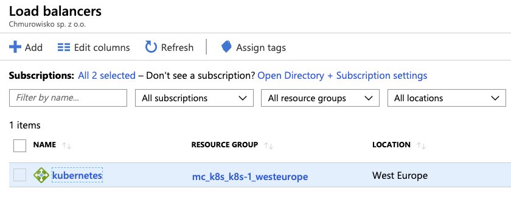

  
  
  

# Ingress

## LAB Overview

#### In this lab you will work with Ingress

During this lab you will manually install NGINX Ingress Controller.

## Task1: Creating Ingress Controller anc LoadBalancer

1. On you cluster, please apply this file, which will create the Ingress Controller based on NGINX. [Azure AKS NINGX Controller](https://kubernetes.github.io/ingress-nginx/deploy/#azure). You can apply this by running ``kubectl apply -f https://raw.githubusercontent.com/kubernetes/ingress-nginx/controller-v1.5.1/deploy/static/provider/cloud/deploy.yaml
``
2. Create a new file by running ``nano cloud-generic.yaml``.
3. Download [manifest file](./files/cloud-generic.yaml) and paste its contents to editor window.
4. Save changes by pressing *CTRL+O* and *CTRL-X*.
5. Run: ``kubectl apply -f cloud-generic.yaml``

You should have a load balancer deployed now. Please check if it's ready.

## Task 2. Creating services

1. Create a new file by running ``nano servicea.yaml``.
2. Download [manifest file](./files/servicea.yaml) and paste its contents to editor window.
3. Save changes by pressing *CTRL+O* and *CTRL-X*.
4. Run: ``kubectl apply -f servicea.yaml``
5. Create a new file by running ``nano serviceb.yaml``.
6. Download [manifest file](./files/service2.yaml) and paste its contents to editor window.
7. Save changes by pressing *CTRL+O* and *CTRL-X*.
8. Run: ``kubectl apply -f serviceb.yaml``

You should have two services now

## Task 3: Creating Ingress object

1. Create a new file by running ``nano ingress.yaml``.
2. Download [manifest file](./files/ingress.yaml) and paste its contents to editor window.
3. Save changes by pressing *CTRL+O* and *CTRL-X*.
4. Run: ``kubectl apply -f ingress.yaml``

## Task 4: Examinig the solution

1. Find your load balancer public IP.

2. Using any browser of your choice or *curl* open following urls:
* <YOUR-LOAD-BALANCER-IP>/myservicea
* <YOUR-LOAD-BALANCER-IP>/myserviceb
You should get different responses from both services you deployed in task 3.

3. Please delete all objects:
* ``kubectl delete -f ingress.yaml``
* ``kubectl delete -f servicea.yaml``
* ``kubectl delete -f serviceb.yaml``
* ``kubectl delete -f cloud-generic.yaml``
* ``kubectl delete -f mandatory.yaml``

## END LAB